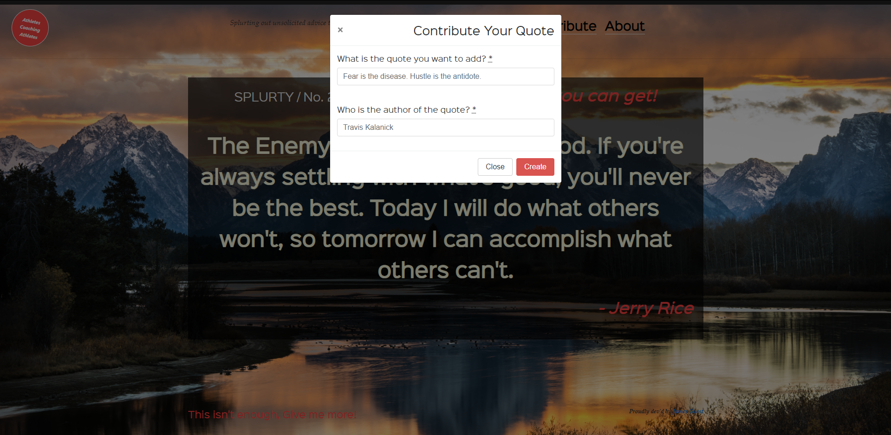

# Splurty

A database-powered quote generator with a mobile-first design, using the Ruby on Rails framework, HTML, and CSS. Uses Git and GitHub for version control, and launched on Heroku.

## Deployment

* [http://splurty-james-guest.herokuapp.com/](http://splurty-james-guest.herokuapp.com/)

## Tech

* [Ruby](https://www.ruby-lang.org/en/documentation/) v: 2.5.3
* [Rails](https://rubyonrails.org/) - v: 5.2.1
* [postgreSQL](https://www.postgresql.org/) - Database
* [Heroku](https://devcenter.heroku.com/) - Deployment
